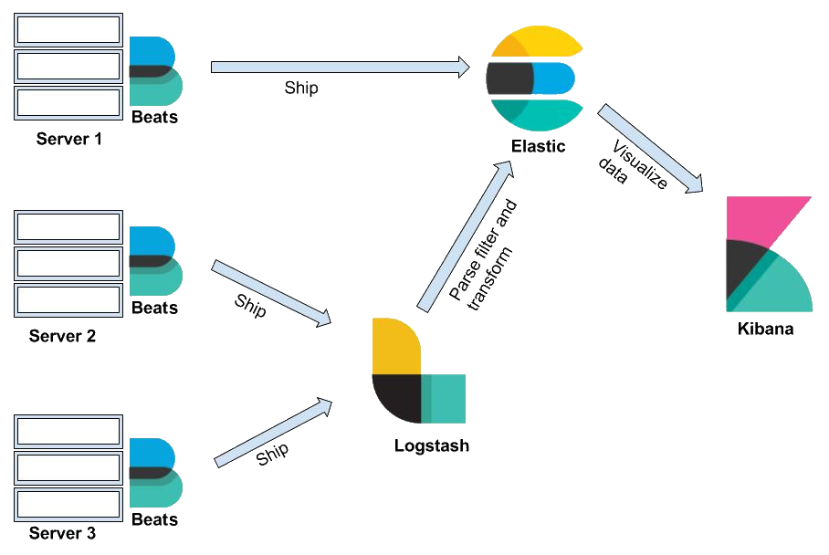

# Elastic Stack
Elastic stack es una tecnología que usa Elasticsearch, Logstash, Kibana y Beats para el monitoreo, análisis y visualización de datos a escala. Esta tecnología puede ser usada para múltiples propósitos y uno de los principales es el de SIEM en equipos de seguridad. Algunas de sus características más relevantes son:
	- Escalamiento Horizontal
	- Clúster y alta disponibilidad
	- Monitoreo y alerta en múltiples partes del stack
	- Múltiples tipos de datos 
	- Compatible con múltiples sistemas operativos
	- Recolección de datos de red, sistema y de seguridad.
	- etc.

## Arquitectura

El primer componente que tiene contacto con el servidor es Beats, un agente que se encarga de enviar los datos al servidor de recolección (Elasticsearch o Logstash). Este agente se configura para enviar los distintos tipos de eventos. Después se encuentra Logstash, este componente se encarga del parseado y transformación de los datos. Por otro lado, estos datos son enviados a Elasticsearch, el motor de búsqueda y analítica de datos. Finalmente, Kibana se encarga de la visualización de los datos.

## Funcionalidad

El caso de uso para este proyecto es el de SIEM (Security Information and Event Management) en este caso los agentes Beats recolectan datos de seguridad como eventos de sistema de Windows y Linux. Estos eventos son procesados para identificar comportamientos anómalos o para su análisis en respuesta de incidentes de ciberseguridad.

## Despliegue

Para el despliegue se usan los siguientes comandos:
	
1. helm repo add elastic https://helm.elastic.co
2. helm repo update
3. helm search hub elasticsearch
4. helm install elasticsearch elastic/elasticsearch -f values_elastic.yml
5. kubectl port-forward svc/elasticsearch-master 9200:9200 --address='0.0.0.0'
6. curl http://localhost:9200/
7. helm install filebeat elastic/filebeat -f values_filebeat.yml
8. curl http://localhost:9200/_cat/indices
9. helm install kibana elastic/kibana
10. kubectl port-forward svc/kibana-kibana 5601:5601

[Link a tutoria](https://www.linode.com/docs/guides/how-to-deploy-the-elastic-stack-on-kubernetes/)
